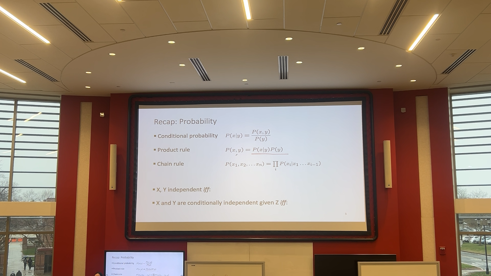
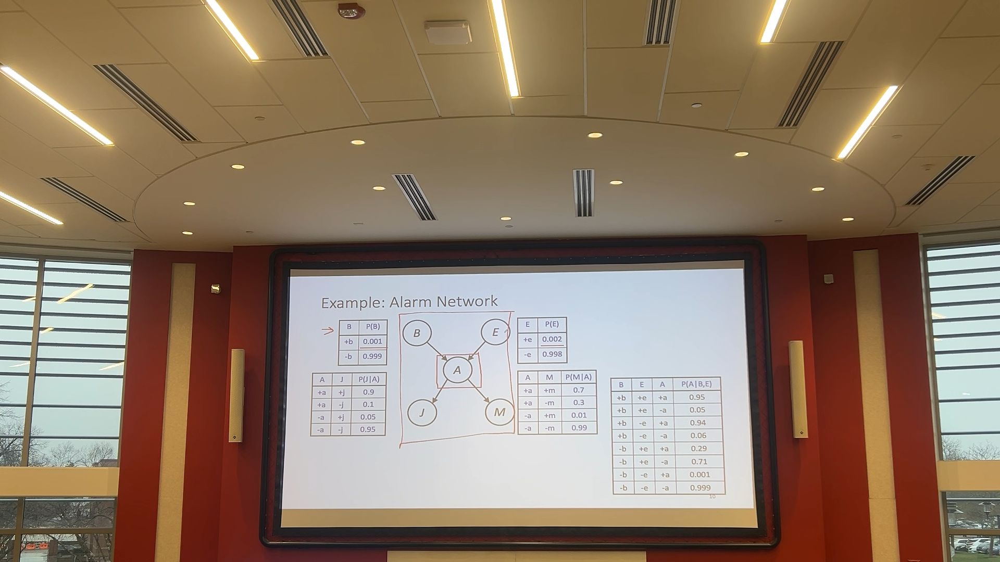
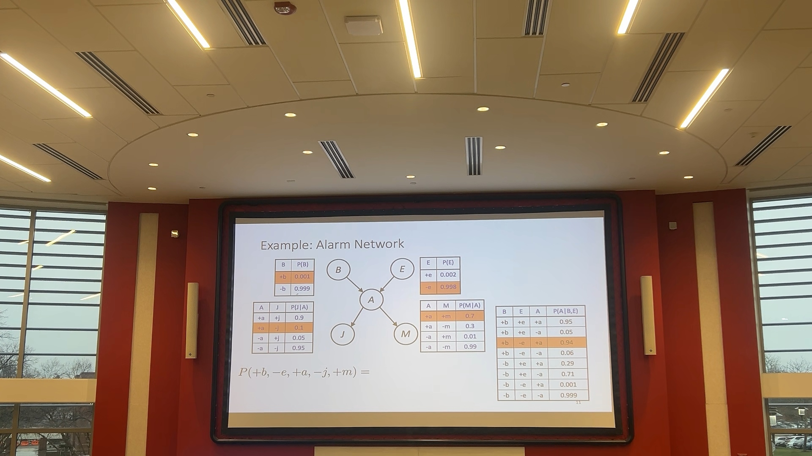

# Lecture 16

## Recap

### Bayesian Networks Semantics
- Directed Acyclic graph (DAG). One node per random variable.
- Conditional Probability Table (CPT) for each node.
- Probabilities for X, one for each combination of parent's values.
- X is a random variable; we denote any realized or actual values in the domain with a lowercase letter.
  - Given the evidence of $a_1$ to $a_n$, what is the probability of discrete random variable X?
- Given a BN graph, what kinds of distributions can it encode?
- What BN is most appropriate for a given domain?
- Given a fixed BN, what is P(X|e)?

### Alarm Network
- 
- Conditional probability given B and E.
  - Directly derived from the topology.
  - What is the probability of my alarm going off?
  - Assume domain size is 2 for every variable.
  - Size of CPT table is $d^n$, so if 3 variables with domain size 2, it's 8 rows in the table.
  - This is how you interpret the table: 4 Conditional Probability Tables, each accounting for different evidence.
    - Whether burglary or earthquake is positive or negative.
- Whether John is calling table:
  - Positive or negative J.
  - Each one regarding different evidence.
  - We can reconstruct or answer any query about the joint probability.
- No assumptions are made; trying to find joint probabilities. What would be the space of it?
  - $2^5$ would be the space. Each variable has a domain of 2, and there are 5 variables.
  - The joint probability table would have 32 entries.
  - The joint probability table would have 32 entries.
  - 

 
### Bayesian networks Assumptions
- Encodes and simplifies a joint distribution using the notion of conditional independence
- How to answer queries about that distribution
- Answer queries about condiitonal independence and influence
- Cond independence assumptions directly from simplifications in chain rule
- 
- 